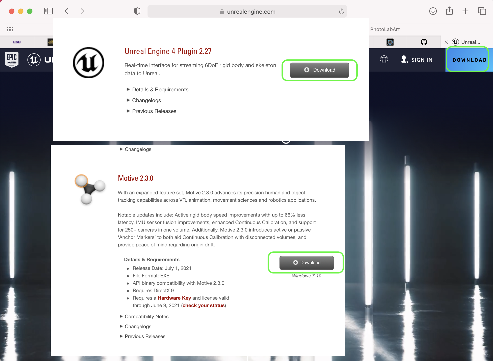
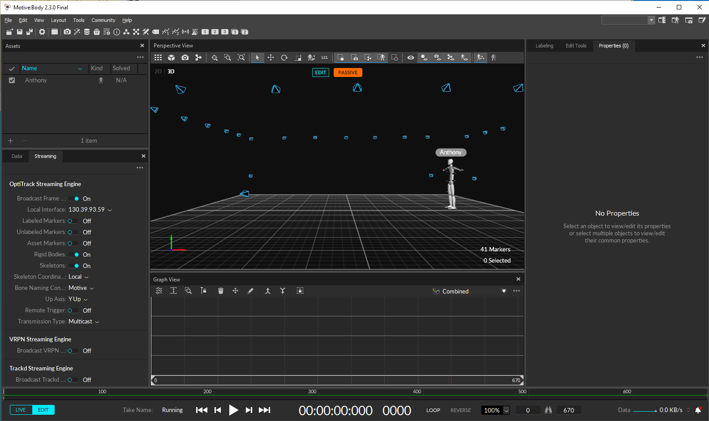
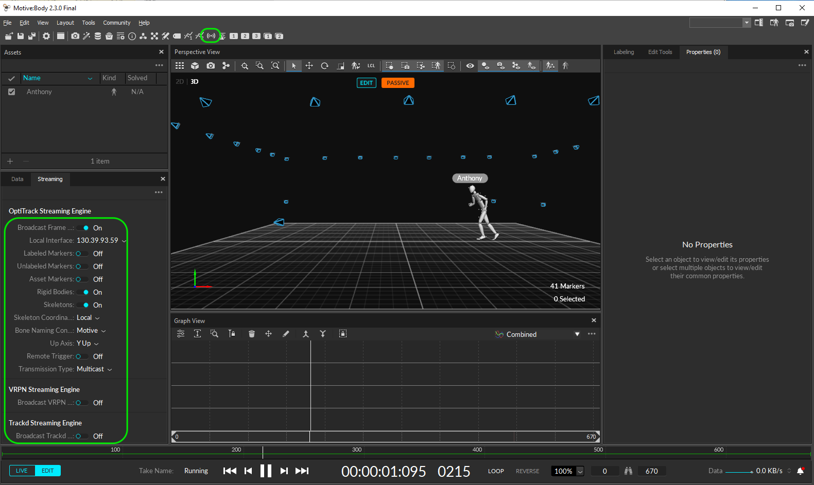
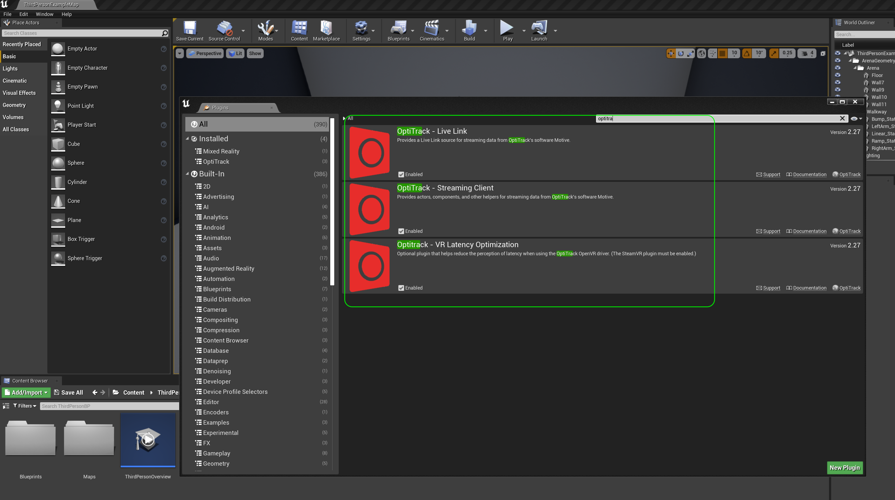
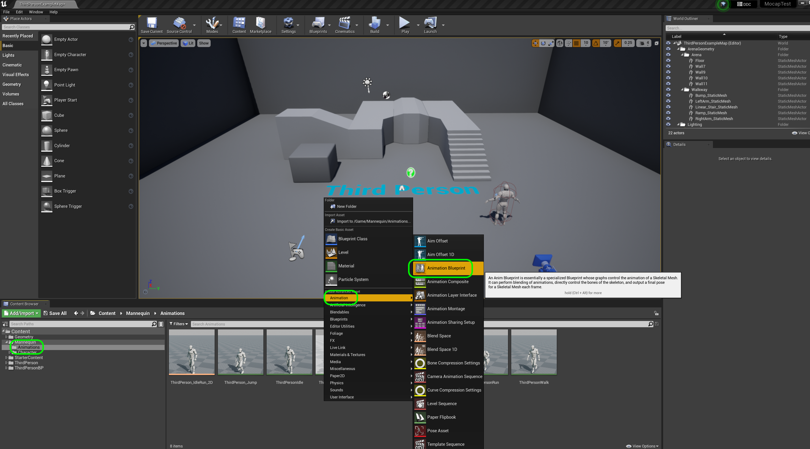
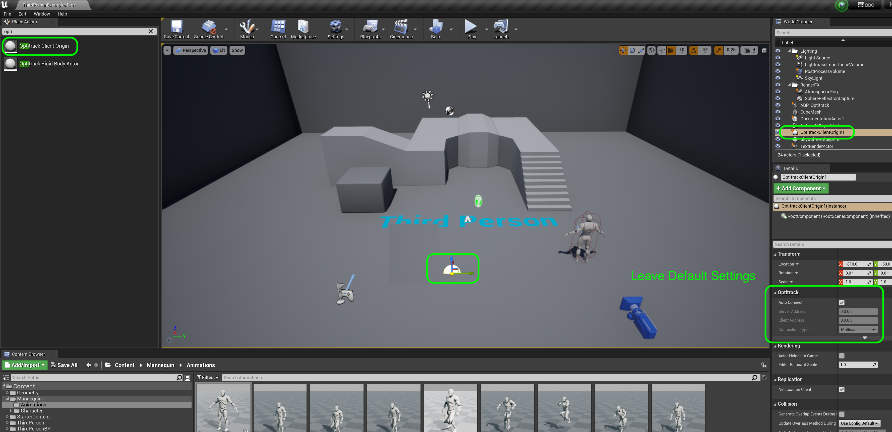
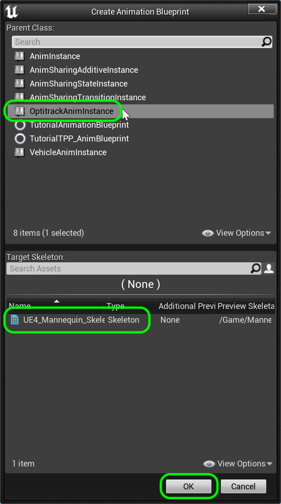
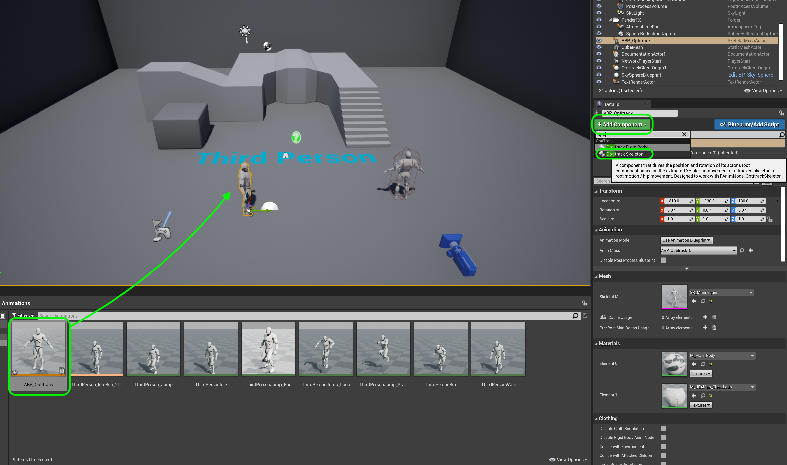
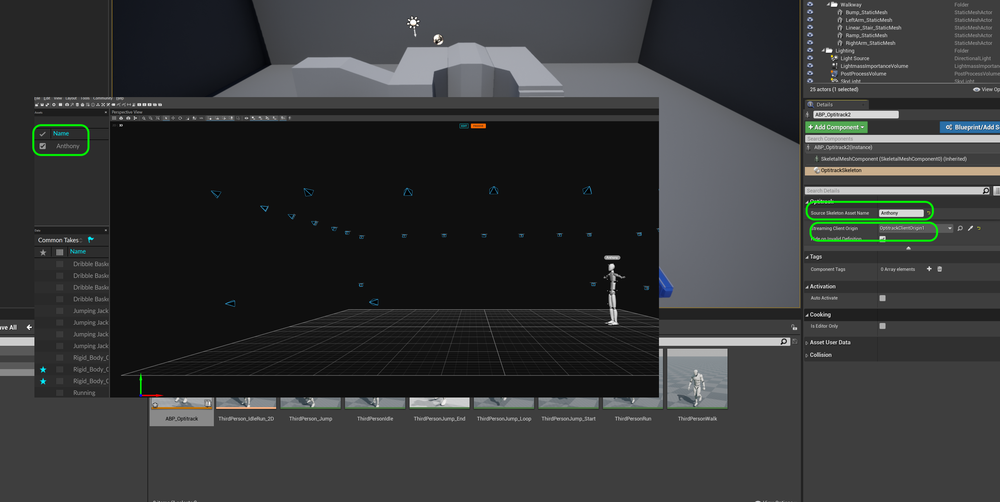
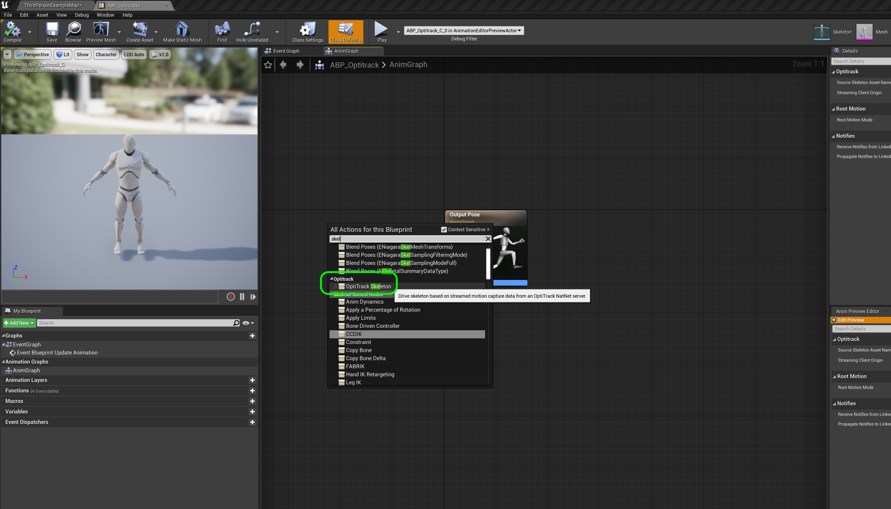

### Quick Start

[previous](../) • [home](../README.md#user-content-ue4-static-meshes) • [next](../)

The least number of steps to get an animation playing in motive (either live captured or in editor mode playing back) into Unreal Engine.

 

---

##### `Step 1.`\|`SUU&G`|:small_blue_diamond:

Make sure you have installed [UE4](https://epicgames.com/store/download) 4.27 & [Motiv](https://optitrack.com/support/downloads/motive.html) 2.30 with the [Unreal Engine 4 Plugin 2.27](https://www.optitrack.com/support/downloads/plugins.html).

The downloaded plugins need to be put in the **UE_4.27 | Engine | Plugins** folder.  You need to unzip and copy the entire contents of the `Optitrack` folder.

##### `Step 2.`\|`FHIU`|:small_blue_diamond: :small_blue_diamond: 

 Make sure you are capturing data in Motiv with the Opti Track cameras or playing back in Motiv in the editor (same difference).

##### `Step 3.`\|`SUU&G`|:small_blue_diamond: :small_blue_diamond: :small_blue_diamond:

Click the **Live Streaming** button in the top menu bar (looks like a wifi icon) and make sure **Broadcast Frame**, **Rigid Bodies** and **Skeletons** are set to `On`. Make sure **Local Interface** is at an accessible **IP Address**. Ensure that **Labeled Markers**, **Asset Markers**, **Remote Trigger**, **Broadcast VRPN** and **Broadcast Trackd...** are ll set to `Off`.  Set **Skeleton Coordinates** to `Local` and **Bone Naming Convention** to `Motive`.  You can leave `YUp` as the **Up Axis**.

##### `Step 4.`\|`SUU&G`|:small_blue_diamond: :small_blue_diamond: :small_blue_diamond: :small_blue_diamond:

Go to **Edit | Plugins** and install the three **Opti Track Plugins**.  Make sure the plugin versions match the version of Unreal. You will be prompted to reboot the engine to properly load up the plugins.

##### `Step 5.`\|`SUU&G`| :small_orange_diamond:

Create a new **Unreal** project with the **Game | Third Person** template. This gives us access to the **Mannequin** and its skeleton.

Go to the **Animations** folder and add a **Animation | Animation Blueprint**.

##### `Step 6.`\|`SUU&G`| :small_orange_diamond: :small_blue_diamond:

Add an **Optritrack Client Origin** actor to the level.  This is where the 0,0,0 spot from Optritrack will run the animation.  Adjust the **Z** so the model is walking on the ground.  Leave the default settings alone in this actor.

##### `Step 7.`\|`SUU&G`| :small_orange_diamond: :small_blue_diamond: :small_blue_diamond:

Select a **Parent Class** of `OptitrackAnimInstance` and the `UE4_Mannequin_Skeleton` as the **Skeleton**.  Press the <kbd>OK</kbd> button.

##### `Step 8.`\|`SUU&G`| :small_orange_diamond: :small_blue_diamond: :small_blue_diamond: :small_blue_diamond:

Name this animation blueprint `ABP_Optitrack` and drag a copy in the level.  Press the <kbd>Add Component</kbd> button and add an `Optitrack Skeleton` component.

##### `Step 9.`\|`SUU&G`| :small_orange_diamond: :small_blue_diamond: :small_blue_diamond: :small_blue_diamond: :small_blue_diamond:

Now give the same name to the **Source Skeleton Asset Name** that was used on the skeleton in the scene in **Motiv**.  In this case it is `Anthony`. Then select the `Optitrack Client Origin` for **Streaming Client Origin** that was placed in the level.

##### `Step 10.`\|`SUU&G`| :large_blue_diamond:

Open up **ABP_Optitrack** and add a 

##### `Step 11.`\|`SUU&G`| :large_blue_diamond: :small_blue_diamond: 

##### `Step 12.`\|`SUU&G`| :large_blue_diamond: :small_blue_diamond: :small_blue_diamond: 

##### `Step 13.`\|`SUU&G`| :large_blue_diamond: :small_blue_diamond: :small_blue_diamond:  :small_blue_diamond: 

##### `Step 14.`\|`SUU&G`| :large_blue_diamond: :small_blue_diamond: :small_blue_diamond: :small_blue_diamond:  :small_blue_diamond: 

##### `Step 15.`\|`SUU&G`| :large_blue_diamond: :small_orange_diamond: 

##### `Step 16.`\|`SUU&G`| :large_blue_diamond: :small_orange_diamond:   :small_blue_diamond: 

##### `Step 17.`\|`SUU&G`| :large_blue_diamond: :small_orange_diamond: :small_blue_diamond: :small_blue_diamond:

##### `Step 18.`\|`SUU&G`| :large_blue_diamond: :small_orange_diamond: :small_blue_diamond: :small_blue_diamond: :small_blue_diamond:

##### `Step 19.`\|`SUU&G`| :large_blue_diamond: :small_orange_diamond: :small_blue_diamond: :small_blue_diamond: :small_blue_diamond: :small_blue_diamond:

##### `Step 20.`\|`SUU&G`| :large_blue_diamond: :large_blue_diamond:

##### `Step 21.`\|`SUU&G`| :large_blue_diamond: :large_blue_diamond: :small_blue_diamond:

___

| [previous](../)| [home](../README.md#user-content-ue4-static-meshes) | [next](../)|
|---|---|---|
